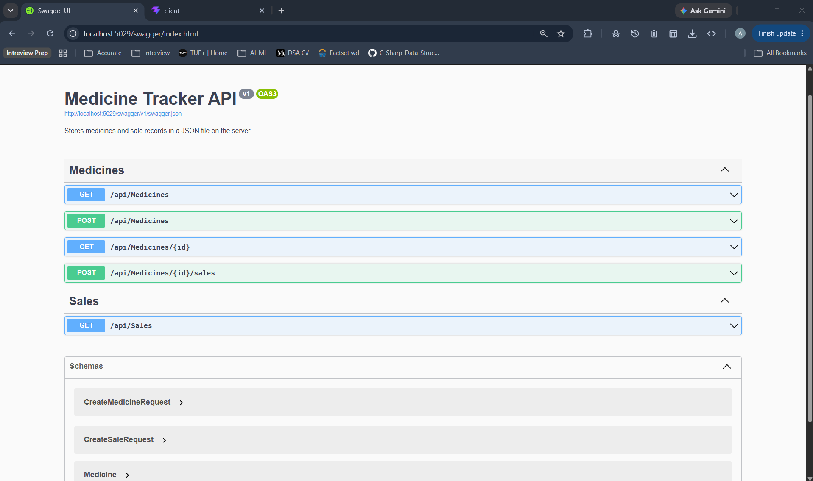
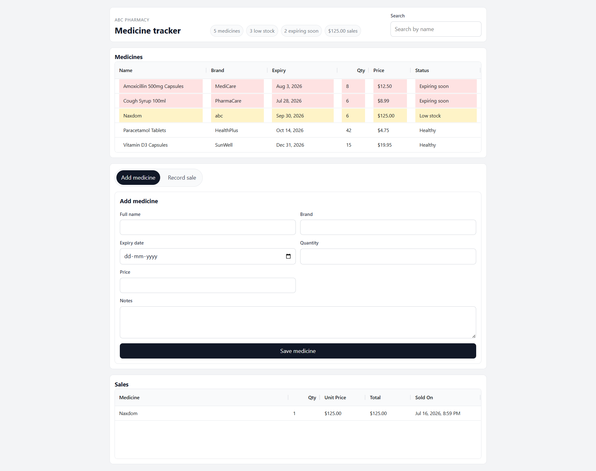

# ABC Pharmacy Medicine Tracker App

This workspace contains two apps:

- `api` - ASP.NET Core Web API with Swagger and JSON-file storage
- `client` - React SPA for viewing, adding, and selling medicines



## API

```bash
cd api
dotnet run
```

Swagger is available at `http://localhost:5029/swagger` when running in development.

The API stores data in `api/Data/medicines.json`.

## Client



```bash
cd client
npm install
npm run dev
```

The client talks to the API at `http://localhost:5029/api` by default. If the API runs on a different port, set `VITE_API_BASE_URL` before starting the client.

##Lib : 
Ag grid for grid

## Features

- Medicine list grid without the Notes column
- Red row styling for medicines expiring in less than 30 days
- Yellow row styling for medicines with stock below 10
- Search by medicine name
- Add medicine form
- Sale record form
- Sale history grid
